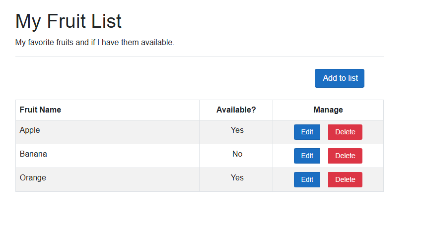

---
lab:
  title: 'Übung: Implementieren von HTTP-Vorgängen in ASP.NET Core Razor Pages'
  module: 'Module: Implement HTTP operations in ASP.NET Core Razor Pages'
---

In dieser Übung erfahren Sie, wie Sie einer ASP.NET Core Razor Pages-App Code hinzufügen, um den HTTP-Client zu erstellen und `GET`-, `POST`-, `PUT`- und `DELETE`-Vorgänge auszuführen. Dieser Code wird den *.cshtml.cs*-CodeBehind-Dateien hinzugefügt. Der Code zum Rendern der Daten in den *CSHTML*-Dateien ist vollständig.

## Ziele

Nachdem Sie diese Übung abgeschlossen haben, können Sie Folgendes:

* Implementieren von `IHttpClientFactory` als HTTP-Client
* Implementieren von HTTP-Vorgängen in ASP.NET Core Razor Pages

## Voraussetzungen

Um die Übung durchzuführen, müssen die folgenden Komponenten auf Ihrem System installiert sein:

* [Visual Studio Code](https://code.visualstudio.com)
* [Das aktuelle .NET 7.0 SDK](https://dotnet.microsoft.com/download/dotnet/7.0)
* [Die C#-Erweiterung](https://marketplace.visualstudio.com/items?itemName=ms-dotnettools.csharp) für Visual Studio Code

**Geschätzte Bearbeitungszeit dieser Übung:** 30 Minuten

## Übungsszenario

Diese Übung verfügt über zwei Komponenten:

* Eine App, die HTTP-Anforderungen an eine API sendet. Die App wird auf `http://localhost:5010` ausgeführt
* Eine API, die auf HTTP-Anforderungen antwortet. Die API wird auf `http://localhost:5050` ausgeführt


## Laden Sie den Code herunter.

In diesem Abschnitt laden Sie den Code für die Web-App Fruit und die Fruit-API herunter. Sie führen die Fruit-API auch lokal aus, damit sie für die Web-App verfügbar ist.

### Aufgabe 1: Herunterladen und Ausführen des API-Codes

1. Klicken Sie mit der rechten Maustaste auf den folgenden Link, und wählen Sie die Option **Link speichern unter** aus. 

    * Code [FruitAPI-Projektcode](https://raw.githubusercontent.com/MicrosoftLearning/APL-2002-develop-aspnet-core-consumes-api/master/Allfiles/Downloads/FruitAPI.zip)

1. Starten Sie **Datei-Explorer **, und navigieren Sie zu dem Speicherort, an dem die Datei gespeichert wurde.

1. Entpacken Sie die Datei in einen eigenen Ordner.

1. Öffnen Sie **Windows-Terminal** oder eine **Eingabeaufforderung**, und navigieren Sie zu dem Speicherort, an dem Sie den Code für die API extrahiert haben.

1. Führen Sie im Bereich **Windows-Terminal** folgenden `dotnet`-Befehl aus:

    ```
    dotnet run
    ```

1. Im Folgenden finden Sie ein Beispiel für die generierte Ausgabe. Beachten Sie die Zeile `Now listening on: http://localhost:5050` in der Ausgabe. Sie identifiziert den Host und Port für die API.

    ```
    info: Microsoft.EntityFrameworkCore.Update[30100]
          Saved 3 entities to in-memory store.
    info: Microsoft.Hosting.Lifetime[14]
          Now listening on: http://localhost:5050
    info: Microsoft.Hosting.Lifetime[0]
          Application started. Press Ctrl+C to shut down.
    info: Microsoft.Hosting.Lifetime[0]
          Hosting environment: Development
    info: Microsoft.Hosting.Lifetime[0]
          Content root path: 
          <project location>
    ```

>**Hinweis:** Lassen Sie die Fruit-API während der restlichen Übung laufen. 

### Aufgabe 2: Herunterladen und Öffnen des Web-App-Projekts

1. Klicken Sie mit der rechten Maustaste auf den folgenden Link, und wählen Sie die Option **Link speichern unter** aus. 

    * [CodeBehind-Projektcode für Fruit-Web-App](https://raw.githubusercontent.com/MicrosoftLearning/APL-2002-develop-aspnet-core-consumes-api/master/Allfiles/Downloads/FruitWebApp-codebehind.zip)

1. Starten Sie **Datei-Explorer **, und navigieren Sie zu dem Speicherort, an dem die Datei gespeichert wurde.

1. Entpacken Sie die Datei in einen eigenen Ordner.

1. Starten Sie Visual Studio Code, und wählen Sie in der Menüleiste **Datei** und dann **Ordner öffnen** aus.

1. Navigieren Sie zu dem Speicherort, an dem Sie die Projektdateien extrahiert haben, und wählen Sie den Ordner *FruitWebApp-codebehind* aus.

1. Die Projektstruktur im Bereich **Explorer** sollte dem folgenden Screenshot ähneln. Sollte der Bereich **Explorer** nicht sichtbar sein, wählen Sie in der Menüleiste **Ansicht** und anschließend **Explorer** aus.

    

>**Hinweis:** Nehmen Sie sich Zeit, um den Code in den einzelnen Dateien zu überprüfen, die während dieser Übung bearbeitet werden. Der Code enthält viele Kommentare, und dies kann Ihnen helfen, die Codebasis zu verstehen.

## Implementieren von Code für den HTTP-Client und den `GET`-Vorgang

Die Web-App Fruit zeigt die API-Beispieldaten auf der Startseite an. Sie müssen Code hinzufügen, um sowohl den HTTP-Client als auch den `GET`-Vorgang zu implementieren, damit die Web-App Daten auf der Startseite anzeigt, wenn sie zum ersten Mal erstellt und ausgeführt wird.

### Aufgabe 1: Implementieren des HTTP-Clients

1. Wählen Sie im Bereich **Explorer** die Datei *Program.cs* aus, um sie zur Bearbeitung zu öffnen.

1. Fügen Sie den folgenden Code zwischen den Kommentaren `// Begin HTTP client code` und `// End of HTTP client code` hinzu.

    ```csharp
    // Add IHttpClientFactory to the container and set the name of the factory
    // to "FruitAPI". The base address for API requests is also set.
    builder.Services.AddHttpClient("FruitAPI", httpClient =>
    {
        httpClient.BaseAddress = new Uri("http://localhost:5050/fruitlist/");
    });
    ```

1. Speichern Sie die Änderungen an *Program.cs*.

### Aufgabe 2: Implementieren des GET-Vorgangs

1. Wählen Sie im Bereich **Explorer** die Datei *Index.cshtml.cs* aus, um sie zur Bearbeitung zu öffnen.

1. Fügen Sie den folgenden Code zwischen den Kommentaren `// Begin GET operation code` und `// End GET operation code` hinzu.

    ```csharp
    // OnGet() is async since HTTP requests should be performed async
      public async Task OnGet()
      {
          // Create the HTTP client using the FruitAPI named factory
          var httpClient = _httpClientFactory.CreateClient("FruitAPI");

          // Perform the GET request and store the response. The empty parameter
          // in GetAsync doesn't modify the base address set in the client factory 
          using HttpResponseMessage response = await httpClient.GetAsync("");

          // If the request is successful deserialize the results into the data model
          if (response.IsSuccessStatusCode)
          {
              using var contentStream = await response.Content.ReadAsStreamAsync();
              FruitModels = await JsonSerializer.DeserializeAsync<IEnumerable<FruitModel>>(contentStream);
          }
      }
    ```

1. Speichern Sie die Änderungen in der Datei *Index.cshtml.cs*.

1. Überprüfen Sie den Code in der Datei *Index.cshtml.cs*. Beachten Sie, wo `IHttpClientFactory` zur Seite mit Abhängigkeitsinjektion hinzugefügt wird. Beachten Sie außerdem, dass das Datenmodell mithilfe des `[BindProperty]`-Attributs an die Seite gebunden wird.

### Aufgabe 3: Ausführen der Web-App

1. Wählen Sie im oberen Menü in Visual Studio Code **Ausführen \| Debuggen starten** aus, oder drücken Sie **F5**. Nachdem das Projekt fertiggestellt ist, sollte ein Browserfenster mit der ausgeführten Web-App geöffnet werden und die API-Beispieldaten anzeigen, wie im folgenden Screenshot dargestellt.

    

    >**Hinweis:** Im weiteren Verlauf der Übung fügen Sie Code hinzu, um die Funktionen zum Hinzufügen, Bearbeiten und Löschen in der Web-App zu aktivieren. 

    >**Hinweis:** Sie können die folgende Eingabeaufforderung problemlos ignorieren, wenn sie während der Ausführung der App angezeigt wird.

    

1. Wenn Sie mit der Übung fortfahren möchten, schließen Sie den Browser oder die Browserregisterkarte, und wählen Sie in Visual Studio Code **Ausführen \| Debuggen beenden** aus, oder drücken Sie **UMSCHALT+F5**.

## Implementieren von Code für die Vorgänge POST, PUT und DELETE

In diesem Abschnitt fügen Sie dem Projekt Code hinzu, um die Funktionen **Zu Liste hinzufügen**, **Bearbeiten** und **Löschen** in der Web-App zu aktivieren. 

### Aufgabe 1: Implementieren des POST-Vorgangs

1. Wählen Sie im Bereich **Explorer** die Datei *Add.cshtml.cs* aus, um sie zur Bearbeitung zu öffnen.

1. Fügen Sie den folgenden Code zwischen den Kommentaren `// Begin POST operation code` und `// End POST operation code` hinzu.

    ```csharp
    public async Task<IActionResult> OnPost()
    {
        // Serialize the information to be added to the database
        var jsonContent = new StringContent(JsonSerializer.Serialize(FruitModels),
            Encoding.UTF8,
            "application/json");
    
        // Create the HTTP client using the FruitAPI named factory
        var httpClient = _httpClientFactory.CreateClient("FruitAPI");
    
        // Execute the POST request and store the response. The parameters in PostAsync 
        // direct the POST to use the base address and passes the serialized data to the API
        using HttpResponseMessage response = await httpClient.PostAsync("", jsonContent);
    
        // Return to the home (Index) page and add a temporary success/failure 
        // message to the page.
        if (response.IsSuccessStatusCode)
        {
            TempData["success"] = "Data was added successfully.";
            return RedirectToPage("Index");
        }
        else
        {
            TempData["failure"] = "Operation was not successful";
            return RedirectToPage("Index");
        }
    }
    ```

1. Speichern Sie die Änderungen in der Datei *Add.cshtml.cs*, und überprüfen Sie die Kommentare im Code.

1. Wählen Sie im oberen Menü in Visual Studio Code **Ausführen \| Debuggen starten** aus, oder drücken Sie **F5**. Nachdem das Projekt fertiggestellt ist, sollte ein Browserfenster mit der ausgeführten Webanwendung geöffnet werden.

1. Wählen Sie die Schaltfläche **Zur Liste hinzufügen** aus, und füllen Sie das generierte Formular aus. Wählen Sie dann die Schaltfläche **Erstellen** aus.

1. Vergewissern Sie sich, dass Ihre Hinzufügung am Ende der Liste angezeigt wird. Die Erfolgs-/Fehlermeldung am oberen Rand der Seite benachrichtigt Sie, wenn ein Problem aufgetreten ist.

1. Wenn Sie mit der Übung fortfahren möchten, schließen Sie den Browser oder die Browserregisterkarte, und wählen Sie in Visual Studio Code **Ausführen \| Debuggen beenden** aus, oder drücken Sie **UMSCHALT+F5**.

### Aufgabe 1: Implementieren des PUT-Vorgangs

1. Wählen Sie im Bereich **Explorer** die Datei *Edit.cshtml.cs* aus, um sie zur Bearbeitung zu öffnen.

1. Fügen Sie den folgenden Code zwischen den Kommentaren `// Begin PUT operation code` und `// End PUT operation code` hinzu.

    ```csharp
    public async Task<IActionResult> OnPost()
        {
            // Serialize the information to be edited in the database
            var jsonContent = new StringContent(JsonSerializer.Serialize(FruitModels),
                Encoding.UTF8,
                "application/json");
    
            // Create the HTTP client using the FruitAPI named factory
            var httpClient = _httpClientFactory.CreateClient("FruitAPI");
    
            // Execute the PUT request and store the response. The parameters in PutAsync 
            // appends the item Id to the base address and passes the serialized data to the API
            using HttpResponseMessage response = await httpClient.PutAsync(FruitModels.id.ToString(), jsonContent);
    
            // Return to the home (Index) page and add a temporary success/failure 
            // message to the page.
            if (response.IsSuccessStatusCode)
            {
                TempData["success"] = "Data was edited successfully.";
                return RedirectToPage("Index");
            }
            else
            {
                TempData["failure"] = "Operation was not successful";
                return RedirectToPage("Index");
            }
    
        }
    ```

1. Speichern Sie die Änderungen in der Datei *Edit.cshtml.cs*, und überprüfen Sie die Kommentare im Code.

1. Wählen Sie im oberen Menü in Visual Studio Code **Ausführen \| Debuggen starten** aus, oder drücken Sie **F5**. Nachdem das Projekt fertiggestellt ist, sollte ein Browserfenster mit der ausgeführten Webanwendung geöffnet werden.

1. Wählen Sie in der Liste ein Element aus, das bearbeitet werden soll, und wählen Sie anschließend die Schaltfläche **Bearbeiten** aus. 
1. Bearbeiten Sie die Felder **Fruit Name** und **Available?**, und wählen Sie dann **Aktualisieren** aus.

1. Überprüfen Sie, ob Ihre Änderungen in der Liste angezeigt werden. Die Erfolgs-/Fehlermeldung am oberen Rand der Seite benachrichtigt Sie, wenn ein Problem aufgetreten ist.

1. Wenn Sie mit der Übung fortfahren möchten, schließen Sie den Browser oder die Browserregisterkarte, und wählen Sie in Visual Studio Code **Ausführen \| Debuggen beenden** aus, oder drücken Sie **UMSCHALT+F5**.

### Aufgabe 1: Implementieren des DELETE-Vorgangs

1. Wählen Sie im Bereich **Explorer** die Datei *Delete.cshtml.cs* aus, um sie zur Bearbeitung zu öffnen.

1. Fügen Sie den folgenden Code zwischen den Kommentaren `// Begin DELETE operation code` und `// End DELETE operation code` hinzu.

    ```csharp
    public async Task<IActionResult> OnPost()
    {
        // Create the HTTP client using the FruitAPI named factory
        var httpClient = _httpClientFactory.CreateClient("FruitAPI");
    
        // Appends the data Id for deletion to the base address and performs the operation
        using HttpResponseMessage response = await httpClient.DeleteAsync(FruitModels.id.ToString());
    
        // Return to the home (Index) page and add a temporary success/failure 
        // message to the page.
        if (response.IsSuccessStatusCode)
        {
            TempData["success"] = "Data was deleted successfully.";
            return RedirectToPage("Index");
        }
        else
        {
            TempData["failure"] = "Operation was not successful";
            return RedirectToPage("Index");
        }
    
    }
    ```

1. Speichern Sie die Änderungen in der Datei *Delete.cshtml.cs*, und überprüfen Sie die Kommentare im Code.

1. Wählen Sie im oberen Menü in Visual Studio Code **Ausführen \| Debuggen starten** aus, oder drücken Sie **F5**. Nachdem das Projekt fertiggestellt ist, sollte ein Browserfenster mit der ausgeführten Webanwendung geöffnet werden.

1. Wählen Sie in der Liste ein Element aus, das gelöscht werden soll, und wählen Sie die Schaltfläche **Löschen** aus. 

1. Bearbeiten Sie die Felder **Fruit Name** und **Available?**, und wählen Sie dann **Aktualisieren** aus.

1. Vergewissern Sie sich, dass das Element nicht mehr in der Liste angezeigt wird. Die Erfolgs-/Fehlermeldung am oberen Rand der Seite benachrichtigt Sie, wenn ein Problem aufgetreten ist.

Wenn Sie bereit sind, die Übung zu beenden:

* Schließen Sie den Browser oder die Browserregisterkarte, und wählen Sie in Visual Studio Code **Ausführen \| Debuggen beenden** aus, oder drücken Sie **UMSCHALT+F5**. 

* Beenden Sie die Fruit-API, indem Sie in dem Terminal, in dem sie ausgeführt wird, **STRG+C** drücken.

## Überprüfung

In dieser Übung haben Sie Folgendes gelernt:

* Implementieren von `IHttpClientFactory` als HTTP-Client
* Implementieren von HTTP-Vorgängen in ASP.NET Core Razor Pages-CodeBehind-Dateien
